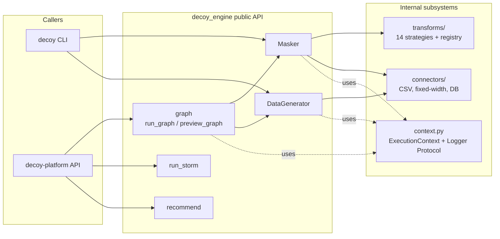

# Architecture

## What this system does

`decoy-engine` is the shared Python data engine behind both the `decoy`
CLI and the `decoy-platform` web product. It owns every operation that
touches data: connector I/O, masking transforms, synthetic generation,
referential integrity, the pipeline-graph runner, and the STORM /
FORECAST analysis modules. Callers (CLI or platform) supply config and
an `ExecutionContext` and call into the public API exported from
`decoy_engine/__init__.py`; nothing else is part of the contract.

## Internal components

## Module map

Inside `src/decoy_engine/`:

| Module | Responsibility |
|---|---|
| `__init__.py` | The public API surface. Anything exported here is contract; `decoy_engine.internal` is private. |
| `context.py` | `ExecutionContext`, `Logger` Protocol, `TelemetryClient` Protocol — the contract callers implement. |
| `masker/` | High-level masking pipeline orchestration (`Masker.mask(table)`). |
| `generators/` | Synthetic data generation (`DataGenerator`), column generators, FK relationships. |
| `transforms/` | 14 masking strategies (faker, hash, redact, map, shuffle, date_shift, formula, passthrough, bucketize, fpe, reference, truncate) plus base + registry + factory. |
| `graph/` | DAG pipeline runner — multi-op pipelines from platform configs. `run_graph`, `preview_graph`, ops registry, topo sort. |
| `connectors/` | CSV, fixed-width, database I/O. Always return `pyarrow.Table`. |
| `storm/`, `forecast/` | Field-sensitivity analysis (STORM) and Disguise recommender (FORECAST). |
| `disguises/` | YAML schema for Disguise objects. |
| `schema/`, `license/` | `SchemaInspector` and `LicenseVerifier` (currently stubs). |
| `internal/` | **Private.** May change between minor versions. |

## Where to start reading

0. **Run the onboarding tour: [`.tours/1-onboarding.tour`](../.tours/1-onboarding.tour)** — narrated 9-stop walkthrough through `__init__.py` → `context.py` → `Masker` → transforms → `run_graph`. Install the [CodeTour](https://marketplace.visualstudio.com/items?itemName=vsls-contrib.codetour) VS Code extension, then open the Tours panel and click "1 - Onboarding".
1. `src/decoy_engine/__init__.py` — what callers can import; if it isn't here, it isn't public.
2. `src/decoy_engine/context.py` — the `Logger` and `TelemetryClient` Protocols every caller implements.
3. `src/decoy_engine/masker/masker.py` — the canonical end-to-end pipeline.
4. `src/decoy_engine/transforms/registry.py` — how new transforms register themselves.
5. `src/decoy_engine/graph/runner.py` — the graph runner the platform calls into.
6. Existing repo-root deep-dives: `SHARED_ENGINE_ARCHITECTURE.md`, `PIPELINE_GRAPH_GUIDE.md`, `DISGUISES_GUIDE.md`, `STORM_FORECAST_GUIDE.md`.

## Sibling maps

- [`decoy/docs/architecture.md`](https://github.com/louiskeep/decoy/blob/main/docs/architecture.md) — CLI interface (commands, UI, dispatch into the engine).
- [`decoy-platform/docs/architecture.md`](https://github.com/louiskeep/decoy-platform/blob/main/docs/architecture.md) — system containers, deployment topology, cross-repo workflows.
