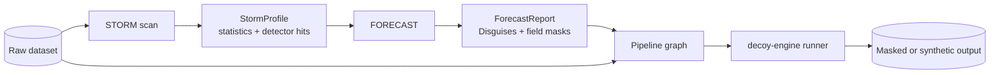
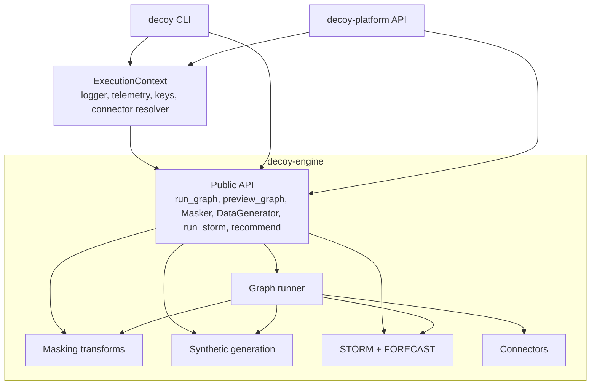
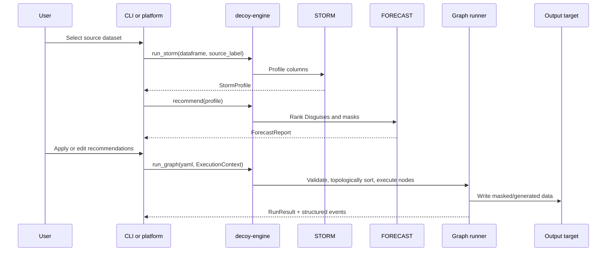
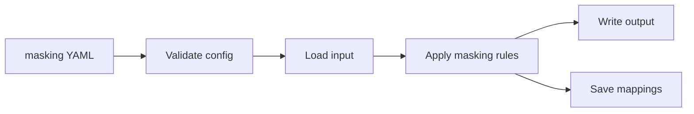
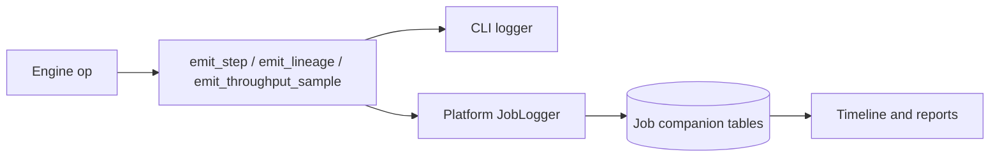

# Product Flow

This guide is the first read for developers who are new to Decoy. It explains
what `decoy-engine` does, how data moves through it, and why the main objects
exist. It assumes you can read Python and YAML. It does not assume you already
know data masking, synthetic data, or privacy tooling.

## What Decoy Is Doing

Decoy turns sensitive production-shaped data into safer data that developers,
test environments, demos, analytics jobs, and downstream systems can use.
The engine supports two related jobs:

- **Mask existing data:** keep the row shape and useful relationships, but
  replace sensitive values.
- **Generate synthetic data:** create new rows that look plausible and can
  preserve table relationships.

The engine also helps decide what should be protected:

- **STORM** scans a dataset and produces a statistical profile.
- **FORECAST** reads that profile and recommends masks and Disguises.
- **Disguises** are named bundles of masking rules, often regulation-aware.

The important boundary: `decoy-engine` touches data, but it does not own the
user interface, job persistence, auth, RBAC, HTTP routes, or report rendering.
Those live in the CLI and platform repos.



## Vocabulary

| Term | Simple meaning |
|---|---|
| PII | Personally identifiable information, such as email, phone, SSN, names, account IDs, or medical identifiers. |
| Mask | A single transform applied to a column, such as `hash`, `faker`, `redact`, `date_shift`, or `fpe`. |
| Disguise | A named bundle of masks and trigger logic, such as `hipaa`, `pci`, or `default`. |
| STORM | The profiler. It inspects values, detects formats and sensitive fields, and returns a JSON-ready `StormProfile`. |
| FORECAST | The recommender. It reads only the `StormProfile`, never raw rows, and returns a `ForecastReport`. |
| Pipeline graph | A YAML DAG of source, transform, analysis, and target nodes. The platform canvas serializes to this format. |
| ExecutionContext | Runtime hooks supplied by a caller: logger, telemetry, connector resolver, key resolvers, and captured outputs. |
| Connector | I/O adapter for files, databases, and cloud storage. Graph source and target ops use these ideas. |
| Referential integrity | Keeping related values stable across tables, such as the same customer ID masking to the same new value everywhere. |

## Where The Engine Sits

`decoy-engine` is a library. The CLI and platform import it. That lets the
same masking, generation, STORM, FORECAST, connectors, and graph runner behave
the same way whether a user runs locally or through the web product.



If you are changing data behavior, start here. If you are changing screens,
routes, users, scheduling, or persistence, start in `decoy-platform`. If you
are changing terminal commands and user-facing CLI copy, start in `decoy`.

## Core Product Flow

Most Decoy workflows follow this loop:

1. A user points Decoy at a dataset.
2. STORM scans the data and records what each column looks like.
3. FORECAST recommends a Disguise and field-level masks.
4. The user accepts or edits those recommendations.
5. Decoy runs a graph pipeline against the source data.
6. The engine writes masked or generated output and emits structured events
   so the caller can show progress, lineage, warnings, and node results.



## Flow 1: STORM Then FORECAST

STORM is the analysis step. It receives a pandas `DataFrame` and returns a
`StormProfile`. The profile contains per-column statistics, detector matches,
sentinel values, distributions, format hints, and dataset-level
re-identification signals.

FORECAST is intentionally narrower. It receives the `StormProfile` and returns
a `ForecastReport`. It does not receive the original rows. This keeps the
recommendation step auditable: recommendations are based on metadata and
statistics, not on a second hidden pass over raw data.

```mermaid
flowchart LR
    DF[pandas DataFrame<br/>raw rows]
    Profiling[Profile columns<br/>types, nulls, distincts, top values]
    Detectors[Run detectors<br/>email, ssn, dates, clinical IDs, payment IDs, etc.]
    Sentinels[Find sentinels<br/>0001-01-01, N/A, outliers]
    Profile[StormProfile]
    Forecast[recommend(profile)]
    Disguises[Ranked Disguises]
    FieldMasks[Field recommendations]
    DraftYaml[Proposed masking YAML]

    DF --> Profiling --> Profile
    DF --> Detectors --> Profile
    DF --> Sentinels --> Profile
    Profile --> Forecast
    Forecast --> Disguises
    Forecast --> FieldMasks
    Forecast --> DraftYaml
```

Example:

```python
import pandas as pd
from decoy_engine import recommend, run_storm

df = pd.DataFrame({
    "patient_id": [1, 2, 3],
    "first_name": ["Ana", "Bo", "Cy"],
    "ssn": ["123-45-6789", "555-12-3456", "111-22-3333"],
    "dob": ["1985-03-15", "1990-07-22", "1972-11-08"],
    "zip": ["90210", "10001", "60601"],
})

profile = run_storm(df, "patients.csv")
report = recommend(profile)

print(profile.row_count)
print([f.name for f in profile.fields if f.detector_matches])
print(report.disguise_recommendations[0].disguise_id)
print(report.proposed_pipeline_yaml)
```

What to notice:

- `run_storm` touches raw values because profiling requires it.
- `recommend` only sees the profile.
- The proposed YAML is a starting point. The caller can show it, edit it, or
  translate it into a graph-canvas configuration.

## Flow 2: Run A Graph Pipeline

Graph mode is the core product execution path for the platform. A graph is a
DAG of node specs and edges. Source nodes read data, transform nodes change or
analyze the table, and target nodes write output.

The public entry points are:

| Function | Purpose |
|---|---|
| `validate_graph(yaml_text)` | Validate structure and per-node config. Raises `PipelineValidationError` when invalid. |
| `preview_graph(yaml_text, node_id, row_limit=50, ctx=None)` | Execute only the ancestors of one node and return sample rows. Targets do not write during preview. |
| `run_graph(yaml_text, ctx=None)` | Execute the full DAG and return per-node status, row counts, exports, and elapsed time. |

Example graph:

```yaml
mode: graph
engine: hybrid
nodes:
  - id: src
    kind: source.file
    name: Patients CSV
    config:
      path: data/patients.csv
      format: csv

  - id: scan
    kind: run_storm
    name: Profile incoming data
    config:
      source_label: patients.csv
      sample_strategy: full

  - id: mask
    kind: mask
    name: Apply HIPAA-ish masks
    config:
      columns:
        first_name:
          strategy: faker
          faker_type: first_name
        ssn:
          strategy: hash
          truncate: 16
        dob:
          strategy: date_shift
          min_days: -30
          max_days: 30
        zip:
          strategy: truncate
          length: 3

  - id: out
    kind: target.file
    name: Masked CSV
    config:
      output_filename: data/patients_masked.csv
      format: csv

edges:
  - from: src
    to: scan
  - from: scan
    to: mask
  - from: mask
    to: out
```

Run it:

```python
from pathlib import Path

from decoy_engine import ExecutionContext, run_graph, validate_graph

yaml_text = Path("pipeline.yaml").read_text()
validate_graph(yaml_text)

ctx = ExecutionContext(logger=my_logger)
result = run_graph(yaml_text, ctx=ctx)

if not result["success"]:
    failed = [node for node in result["nodes"] if node["status"] == "error"][0]
    print(f"Node {failed['node_id']} failed: {failed['error']}")
```

The `run_storm` node is pass-through: it profiles the incoming table and
returns the same table downstream. When the caller provides
`ctx.captured_outputs`, the node appends a serialized STORM profile there so
the platform can persist it.

## What The Graph Runner Does

The graph runner is deliberately small and predictable:

1. Parse YAML.
2. Validate graph shape, node IDs, known node kinds, arity, and cycles.
3. Topologically sort nodes.
4. For each node, collect upstream tables from the cache.
5. Convert the cached Arrow table into the node's native engine.
6. Run the op.
7. Convert the result back to Arrow and cache it for downstream nodes.
8. Emit structured step, lineage, throughput, and node-export events when the
   caller's logger supports them.

```mermaid
flowchart TB
    YAML[Graph YAML]
    Validate[Validate]
    Sort[Topo sort]
    Cache[(Arrow cache)]
    ConvertIn[Materialize to op engine<br/>pandas, DuckDB, Polars, or Arrow]
    Apply[op.apply(inputs, config, ctx)]
    ConvertOut[Convert result to Arrow]
    Record[NodeRunRecord]
    Evict[Evict upstream tables<br/>after last consumer]

    YAML --> Validate --> Sort --> ConvertIn
    Cache --> ConvertIn --> Apply --> ConvertOut --> Cache
    Apply --> Record
    Cache --> Evict
```

The Arrow cache matters because different work is better in different engines:

- Per-row masking and Faker generation stay in pandas.
- File reads and writes can use DuckDB efficiently.
- Future relational transforms can use Polars or DuckDB without changing the
  public graph format.

The top-level graph setting controls this:

```yaml
engine: hybrid  # respect each op's declared native engine
```

Use `engine: pandas` as a compatibility and memory-pressure escape hatch.

## Flow 3: Direct Masking With `Masker`

`Masker` is the direct masking API used by older config-driven flows and by
callers that do not need a graph. It reads a YAML config, loads data through an
I/O handler, applies masking rules, writes output, and saves global mappings
when referential integrity requires them.



Example config:

```yaml
version: "1.0"
global_settings:
  seed: 42

input:
  type: csv
  path: data/customers.csv

output:
  type: csv
  path: data/customers_masked.csv

masking_rules:
  - column: email
    type: faker
    faker_type: email
    preserve_domain: true

  - column: customer_id
    type: hash
    truncate: 12

  - column: signup_date
    type: date_shift
    min_days: -14
    max_days: 14
```

Run it:

```python
from decoy_engine import ExecutionContext, Masker

ctx = ExecutionContext(logger=my_logger, derive_key=my_mask_key_resolver)
Masker("mask_customers.yaml", ctx=ctx).mask()
```

For small files, `Masker` loads the table in memory. For files above the
configured large-file threshold, it switches to chunked processing.

## Flow 4: Generate Synthetic Data

Generation creates rows instead of transforming existing values. You can use
the graph `generate` op, or the direct `DataGenerator` API.

Graph source-style generation:

```yaml
mode: graph
nodes:
  - id: synth
    kind: generate
    config:
      row_count: 3
      seed: 7
      columns:
        customer_id:
          strategy: sequence
          start: 1000
        email:
          strategy: faker
          faker_type: email
        tier:
          strategy: categorical
          categories: [free, team, enterprise]

  - id: out
    kind: target.file
    config:
      output_filename: data/synthetic_customers.csv

edges:
  - from: synth
    to: out
```

Direct generation:

```python
from decoy_engine import DataGenerator, ExecutionContext

ctx = ExecutionContext(logger=my_logger, pipeline_derive_key=my_pipeline_key_resolver)
DataGenerator("generate_customers.yaml", ctx=ctx).generate()
```

Generation has a different key story from masking. Masking uses
`ctx.derive_key`, which is instance-level so the same source value can mask the
same way across pipelines. Generation uses `ctx.pipeline_derive_key`, which can
be scoped to a pipeline label so generated rows are stable for that pipeline
without making every pipeline produce identical synthetic data.

## Determinism And Keys

Developers often ask, "Will the same input produce the same output?" The
answer depends on the runtime context.

| Case | Behavior |
|---|---|
| Mask with `ctx.derive_key` | Preferred. Same input value and same configured key resolver produce the same masked value across runs and instances. Useful for joins and recovery. |
| Mask without `ctx.derive_key` | Legacy seed-based fallback. Some strategies are stable enough for local demos, but it is not the enterprise guarantee. |
| Generate with `ctx.pipeline_derive_key` | Preferred for repeatable synthetic data tied to one pipeline label. |
| Generate without `ctx.pipeline_derive_key` | Seed-based generation. Useful for local tests and demos. |
| FORECAST | Deterministic over the `StormProfile`; no key needed because it does not transform raw values. |

Build a resolver with the public helper when you need a simple local setup:

```python
from decoy_engine import ExecutionContext, make_key_resolver

master = bytes.fromhex("00" * 32)

ctx = ExecutionContext(
    derive_key=make_key_resolver(master, "mask-instance-v1"),
    pipeline_derive_key=make_key_resolver(master, "pipeline-customers-v1"),
)
```

In production, the caller usually owns key storage and passes closures through
`ExecutionContext`.

## Preview And Node Exports

`preview_graph` executes the smallest upstream subgraph needed to sample one
node. This lets a canvas show, "What does data look like after this node?"
without running target side effects.

```python
from decoy_engine import preview_graph

sample = preview_graph(yaml_text, "mask", row_limit=25)

print(sample["columns"])
print(sample["rows"][:3])
print(sample["applied_chain"])
```

Some nodes export scalar metadata through `ctx.export`. The runner records
those exports in the node's `NodeRunRecord`, and downstream node config can
reference completed upstream exports with `${nodes.<id>.<key>}` tokens.

Examples of exported values include:

| Node kind | Example exports |
|---|---|
| `source.file` | `row_count`, `column_count`, `inferred_format`, `file_size_bytes` |
| `run_storm` | `rows_scanned`, `entities_detected`, `reid_risk_score`, `profile_hash` |
| `mask` | `rows_processed`, `strategies_applied`, `null_passthrough_count` |
| `generate` | `rows_generated`, `columns_generated`, `seed_used` |
| `target.file` | `rows_written`, `output_path`, `output_file_size_bytes` |

Exports are available only after the exporting node has run. A node cannot
reference its own future exports, and forward references fail the run with an
actionable error.

## Structured Events

The engine logs normal narrative messages through `Logger.info`,
`Logger.warning`, and `Logger.error`. It can also emit optional structured
events when the caller's logger implements the `StructuredEvents` surface.

Structured events power platform UI features such as step timelines,
throughput charts, lineage views, quarantines, and fidelity rollups. The
engine sends them through safe helper functions, so a plain stdlib logger also
works and simply ignores the extra event calls.



## Supported Graph Node Families

The graph registry currently includes:

| Family | Kinds |
|---|---|
| Sources | `source.file`, `source.db`, `source.s3`, `source.gcs`, `source.sftp` |
| Targets | `target.file`, `target.db`, `target.s3`, `target.gcs`, `target.sftp` |
| Row/table transforms | `filter`, `sort`, `limit`, `dedupe`, `derive`, `drop_column`, `select_column`, `unite`, `convert.file_type`, `sql_run` |
| Privacy/data transforms | `mask`, `generate` |
| Analysis | `run_storm` |
| Control flow | `if`, `flag_gate`, `sub_pipeline`, `iterate_fixed`, `iterate_loop`, `iterate_files` |

Each op declares:

- `KIND`: the YAML `kind`.
- `INPUT_ARITY`: how many incoming tables it accepts.
- `OUTPUT_KIND`: stream, sink, or split.
- `NATIVE_ENGINE`: pandas, DuckDB, Polars, or Arrow.
- `validate_config(config)`.
- `apply(inputs, config, ctx)`.

See [Pipeline Graph](../PIPELINE_GRAPH_GUIDE.md) for the deeper contract.

## How To Extend The Engine

Use this map when adding behavior:

| Goal | Start here |
|---|---|
| Add a new mask strategy | `src/decoy_engine/transforms/`, then register it in `transforms/factory.py` and graph `mask_op` allowlist. |
| Add a graph node | Add a module under `src/decoy_engine/graph/ops/`, register it in `graph/ops/__init__.py`, and add tests for validation, run, and preview behavior. |
| Add a detector | Add it to `src/decoy_engine/storm/detectors.py`, then update Disguise YAML triggers if it should influence recommendations. |
| Add a Disguise | Drop a new YAML file into `src/decoy_engine/disguises/`. The loader auto-discovers `*.yaml` files. |
| Add an I/O backend | Follow the Connector SDK contract and add source or target graph ops when it should be usable from graph YAML. |
| Change the runtime contract callers depend on | Update the public exports in `src/decoy_engine/__init__.py`, tests, and these docs. |

Every extension should include tests at the right level:

- Unit tests for validation and small pure functions.
- Integration tests for full graph or STORM/FORECAST flows.
- Connector contract tests for I/O backends.
- Benchmarks when changing high-volume table operations.

## Reading Map

After this guide, read in this order:

1. [Architecture](architecture.md) for the component map.
2. [Pipeline Graph](../PIPELINE_GRAPH_GUIDE.md) for YAML and op details.
3. [Disguises](../DISGUISES_GUIDE.md) for bundles and detector-trigger logic.
4. [STORM and FORECAST](../STORM_FORECAST_GUIDE.md) for analysis and recommendation details.
5. [Shared Engine Architecture](../SHARED_ENGINE_ARCHITECTURE.md) for the hybrid pandas, DuckDB, Polars, and Arrow substrate.
6. The API reference for function signatures and dataclass fields.

## Mental Checklist For Debugging

When a Decoy flow behaves oddly, ask:

- Did the graph validate, or did execution fail inside a node?
- Which node first produced unexpected rows? Use `preview_graph`.
- Is the pipeline using keyed determinism or seed fallback?
- Did STORM detect the column as expected? Check `detector_matches` and
  `detection_trail`.
- Did FORECAST receive a profile with the detector IDs the Disguise expects?
- Did the caller provide the right `ExecutionContext` for logger, connector
  resolution, keys, and captured outputs?
- Is the issue data behavior, caller-side presentation, or persistence?

That last question keeps the boundary clear: `decoy-engine` computes and
emits structured facts; callers decide how users see, store, and schedule
those facts.
